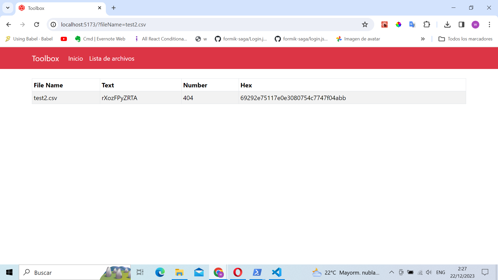

## Descripción

Frontend hecho con `React` para el consumo de REST API que trae data parseada de archivos `csv`

## Prerequisitos

1. Descargar api desde [toolbox-api](https://github.com/wilmer2/tookbox-api)
2. Levantar proyecto con `npm start `

## Instalación

1. Clonar repositorio
2. Instalar dependencias con `npm install`
3. Ejecutar proyecto con

```
npm run dev
```

## Secciones

### Home

.png>)

### Listado archivos

.png>)

### Archivo por queryParams


